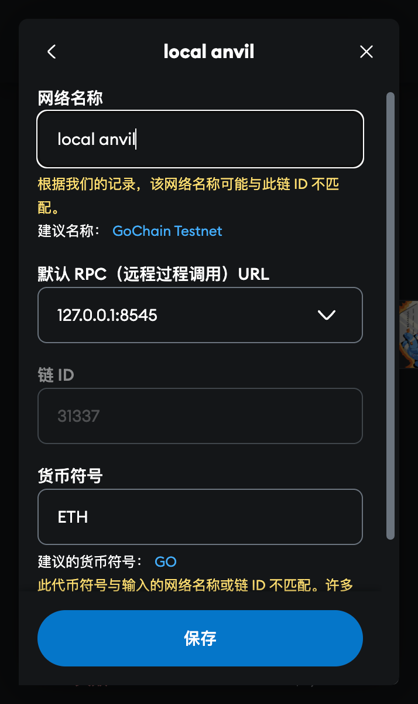

# 前期部署指南

本文档介绍如何启动系统和部署合约的完整流程。

## ⚠️ 环境要求

| 组件     | 版本要求 | 说明           |
| -------- | -------- | -------------- |
| Node.js  | ≥ 16.0   | 运行前端和工具 |
| Python   | ≥ 3.8    | 运行后端服务   |
| MetaMask | 最新版   | 钱包扩展       |
| Foundry  | 最新版   | 智能合约工具链 |

## 0.1 启动程序


系统需要启动四个服务，请在四个终端中分别运行以下命令：

### ① 本地区块链

```bash
anvil --host 0.0.0.0 --port 8545
```

### ② IPFS 节点

```bash
ipfs daemon
```

### ③ 启动 Agent / 后端

```bash
cd ../my_agent_project
export OPENAI_API_KEY=<---Your Key--->     # Windows: set OPENAI_API_KEY=...
python api_server.py
```

### ④ 启动前端

```bash
cd ../frontend
npm install                  # 首次启动需要
npm start
```

## 0.2 部署合约


运行以下命令部署智能合约：

```bash
cd python_call_contract
python deploy.py            # 生成 deploy_address.json
```

### 钱包配置

1. 使用 `metamask` 钱包，将 `anvil` 给出的账户赋予角色：  
   

2. 将本地 `anvil` 启动的私链添加到 `metamask` 中：  
   

## 常见问题

### Q: MetaMask 连接失败？

- 确认网络设置：RPC URL `http://127.0.0.1:8545`，Chain ID `31337`
- 清除浏览器缓存重试

**部署成功标志**：四个服务都正常运行且前端能访问 `http://localhost:3000`

完成以上步骤后，系统就可以正常使用了。
