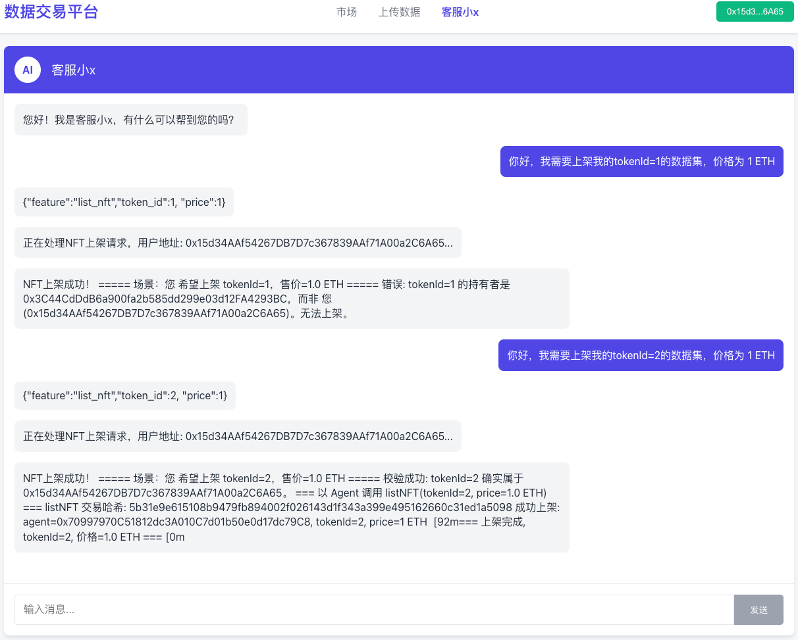

# 数据集上下架指南

本文档介绍如何在平台上架和下架数据集的操作流程。

## 功能概述

上下架数据集泳道图：

数据集登记完成后，所有者可以选择将其上架到市场进行销售，或下架已上架的数据集。

## 数据集上架操作

### 前提条件

- 数据集已成功登记
- 拥有数据集的所有权

### 上架流程

使用 `owner1`、`owner2`、`owner3` 分别上架其对应的数据集：

#### Owner1 上架原始数据集

#### Owner2 上架转售数据集

#### Owner3 上架相似数据集

### 上架后的市场界面

完成上架后，数据集将出现在市场界面中供用户浏览和购买：

## 数据集下架操作

### 下架条件

- 只有数据集所有者可以下架自己的数据集
  
- 下架后数据集将从市场中移除，其他用户无法看到或购买

## 注意事项

### 下架注意事项

- 下架操作无法撤销，需要重新上架才能继续销售
- 下架不会影响已完成的购买交易
