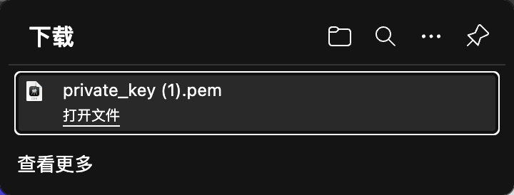
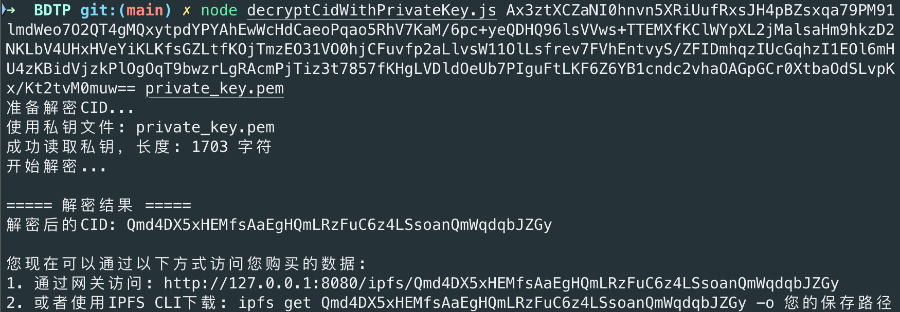

# 数据集购买指南

本文档介绍如何在平台购买数据集的完整流程。

## 功能概述

购买数据集泳道图：


用户可以浏览市场中的数据集，选择合适的数据集进行购买。购买完成后，用户将获得解密数据集的私钥。

## 购买流程

### 1. 浏览市场

在市场界面中浏览可购买的数据集，查看数据集的详细信息、价格等。

### 2. 选择数据集


告知 agent 需要购买的数据集。

### 3. 支付费用

可以使用以下两种方式进行支付：

1. **MetaMask 转账**：通过钱包界面直接转账
2. **命令行转账**：
   ```bash
   cast send 0x70997970C51812dc3A010C7d01b50e0d17dc79C8 --value 1ether --private-key 0x7c852118294e51e653712a81e05800f419141751be58f605c371e15141b007a6 --rpc-url http://127.0.0.1:8545
   ```

### 4. 获取私钥

购买成功后，系统会生成专属的私钥：



> **🔒 重要**：请妥善保存私钥，这是解密数据集的唯一凭证。

## 数据集解密

### 使用私钥解密 CID

使用 `BDTP/decryptCidWithPrivateKey.js` 工具解密得到数据集的真实 CID 值：



### 解密步骤

1. 打开 `BDTP/decryptCidWithPrivateKey.js` 文件
2. 输入购买时获得的私钥
3. 运行解密程序
4. 获得数据集的真实 CID
5. 通过 IPFS 访问数据集内容

## 数据集访问

### 通过 IPFS 访问

获得解密后的 CID 后，可以通过以下方式访问数据集：

1. **IPFS 网关访问**：

   ```
   http://127.0.0.1:8080/ipfs/[解密后的CID]
   ```

2. **IPFS 命令行访问**：

   ```bash
   ipfs get [解密后的CID]
   ```

3. **程序化访问**：
   在代码中使用 IPFS API 获取数据集内容

## 🛡️ 水印机制

### 唯一水印嵌入

购买数据集时，系统会自动嵌入唯一的 `Hash_buy` 水印：

- 每个购买者获得的数据集都包含独特的水印
- 水印用于追踪数据集的流向
- 防止未授权的转售行为

### 防转售检测

如果有人尝试将购买的数据集重新上架到平台：

1. 系统会自动检测数据集中的水印
2. 识别出数据集的原始来源
3. 阻止转售行为并记录违规信息

- 查看日志：`my_agent_project/logs/buy_nft.log`

## 测试转售数据集

用户登记带有水印的数据集：


被检测出来后，如果用户希望得到一个零知识证明，那么需要在网页端贡献一次 powers of tau 的仪式：


用户贡献完成后，后台会继续生成 ptau 文件以及零知识证明，并让用户后续到证明界面领取证明：


后台会继续生成零知识证明，并将验证的所需材料打包压缩，并命名为用户地址：


用户可以前往“证明包下载”界面，网页会识别当前的用户地址，若此时系统检测有该用户的证明包，那么会在前端页面处显示：


证明包的结构为：

```
├── proof_json/
├── public_json/
├── E_verify_proof_public.py
├── package_info.json
├── README.md                 # 演示文档
└── verification_key.json
```
