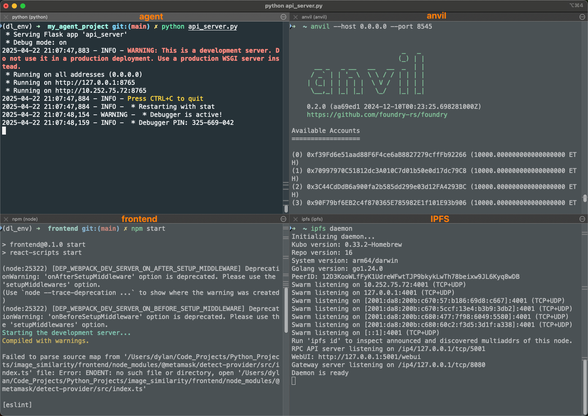
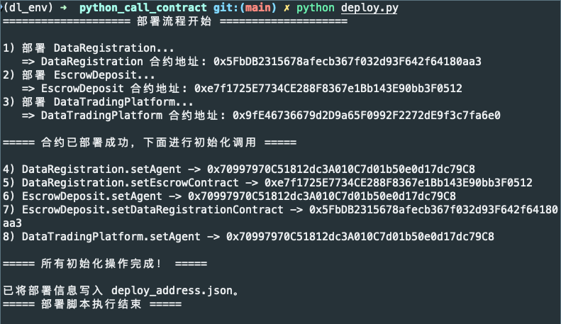
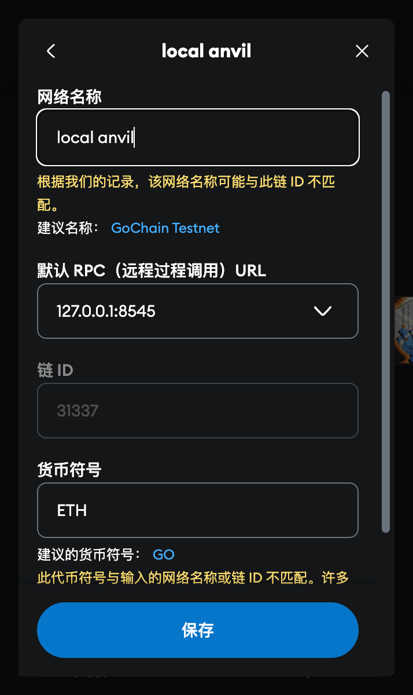

# 0 前期部署

## 0.1 启动程序



四个终端分别运行：

```
# ① 本地区块链
anvil --host 0.0.0.0 --port 8545

# ② IPFS 节点
ipfs daemon

# ③ 启动 Agent / 后端
cd ../my_agent_project
export OPENAI_API_KEY=<---Your Key--->     # Windows: set OPENAI_API_KEY=...
python api_server.py

# ④ 启动前端
cd ../frontend
npm install                  # 首次启动需要
npm start
```

---

## 0.2 部署合约



```
cd python_call_contract
python deploy.py            # 生成 deploy_address.json
```

使用`metamask`钱包，将`anvil`给出的帐户赋予角色：  


将本地`anvil`启动的私链放入到`metamask`中：  


---

# 1 功能一：登记数据集

登记数据集泳道图：

## 1.1 登记 `STL-10` 中关于 `airplane` 的原始数据集


得到 `STL-10-airplane-original` cid 值为：`http://127.0.0.1:8080/ipfs/QmSFJ36fdoMZp8Kv9XsGWB6Jya3Hd1rkTzj8aUkwjtMvJQ`

使用`owner1`帐户登记`STL-10-airplane-original`数据集：


可以使用`metamask`进行转帐；也可以使用命令行转帐：`cast send 0x70997970C51812dc3A010C7d01b50e0d17dc79C8 --value 3ether --private-key 0x5de4111afa1a4b94908f83103eb1f1706367c2e68ca870fc3fb9a804cdab365a --rpc-url http://127.0.0.1:8545`

日志可以在`my_agent_project/features/mint_nft.log`中查看。

## 1.2 登记 `STL-10` 中关于 `airplane` 的转售数据集


得到 `STL-10-airplane-resale` cid 值为：`http://127.0.0.1:8080/ipfs/QmQTqV7kHyGDfJg64HhDqkZ3KdgK7S2EgECiTKQubwFrJ9`

使用`owner2`帐户登记`STL-10-airplane-resale`数据集：


可以使用`metamask`进行转帐；也可以使用命令行转帐：`cast send 0x70997970C51812dc3A010C7d01b50e0d17dc79C8 --value 3ether --private-key 0x47e179ec197488593b187f80a00eb0da91f1b9d0b13f8733639f19c30a34926a --rpc-url http://127.0.0.1:8545`

## 1.3 登记 `STL-10` 中关于 `airplane` 的相似但非转售数据集


得到 `STL-10-airplane-non-resale-but-similarity` cid 值为：`http://127.0.0.1:8080/ipfs/QmdvH8Fo65wBSisH2YQzmmZ4A2ztFDRByD3fr51h6wkEa5`

---

# 2 功能二：上/下架数据集

---

# 3 功能三：购买数据集

---

# 4 功能四：举报数据集
