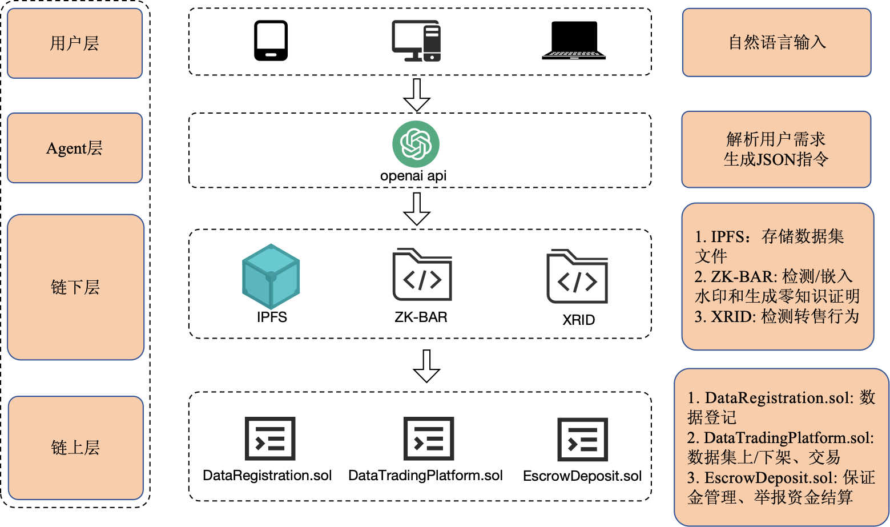

<a href="./zh-CN.md">中文版本 (Chinese Version)</a>

# BDTP — Blockchain Data Trading Platform

\*Open‑source implementation accompanying the paper **“< ------- >”\***

BDTP combines **Solidity smart contracts, IPFS, ZK‑BAR, XRID and an LLM‑powered Agent** to provide an end‑to‑end marketplace that prevents resale infringement of datasets.

---

## Table of Contents

1. [Architecture](#architecture)
2. [Directory Layout](#directory-layout)
3. [Quick Start](#quick-start)
4. [Core Scripts & Features](#core-scripts--features)
5. [Environment & Dependencies](#environment--dependencies)
6. [Citation](#citation)
7. [License](#license)

---

## Architecture



The system is layered as follows:

1. **User** – issues natural‑language requests
2. **Agent** – OpenAI LLM parses intent → JSON commands
3. **Off‑chain Scripts** – Python/Node programs interact with IPFS, run ZK‑BAR / XRID, then call smart contracts
4. **On‑chain** – three Solidity contracts
   - `DataRegistration.sol` (ERC‑721)
   - `DataTradingPlatform.sol`
   - `EscrowDeposit.sol`

---

## Directory Layout

```text
.
├── BDTP/                 # Off‑chain helpers: IPFS client, keypair generation, ZK‑BAR & XRID
├── BDTP_contract/        # Solidity contracts and Foundry build artifacts
├── python_call_contract/ # Python scripts to deploy & invoke contracts
├── my_agent_project/     # OpenAI‑Agent backend (FastAPI)
├── frontend/             # React (Vite) web client
├── docs/                 # Screenshots & demo walkthroughs
├── requirements.txt      # Python dependencies
└── LICENSE               # MIT
```

---

## Quick Start

> **Five parallel terminals** are required.  
> Replace `<YOUR_OPENAI_API_KEY>` with your actual key.

```bash
# Terminal ① – Local blockchain
anvil --host 0.0.0.0 --port 8545

# Terminal ② – IPFS node
ipfs daemon

# Terminal ③ – Deploy contracts
cd python_call_contract
python deploy.py                 # generates deploy_address.json

# Terminal ④ – Backend / Agent
cd ../my_agent_project
export OPENAI_API_KEY=<YOUR_OPENAI_API_KEY>   # Windows: set OPENAI_API_KEY=...
python api_server.py

# Terminal ⑤ – Front‑end
cd ../frontend
npm install                       # first run only
npm start
```

Open <http://localhost:3000> in your browser to access the marketplace UI.

---

## Core Scripts & Features

| Feature                  | Script (+ typical command)                                                                                                   | Description                                    |
| ------------------------ | ---------------------------------------------------------------------------------------------------------------------------- | ---------------------------------------------- |
| **Dataset Registration** | `python function_1_register_dataset.py <owner_addr> <cid>`                                                                   | Uploads to IPFS, mints an NFT, collects a bond |
| **Listing / Un‑listing** | `python function_2_list_nft.py <owner_addr> <tokenId> <price>`  <br>`python function_3_unlist_nft.py <owner_addr> <tokenId>` | Interacts with `DataTradingPlatform`           |
| **Purchase**             | `python function_4_buy_nft.py check <tokenId>`  <br>`python function_4_buy_nft.py purchase <bob_addr> <tokenId> <price>`     | Generates watermark, ZKP, transfers NFT        |
| **Resale Reporting**     | `python function_7_informer.py report <tokenIdA> <tokenIdB> <jinxAddr>`                                                      | Off‑chain XRID + `EscrowDeposit` settlement    |
| **Gas Analytics**        | `python gas_cost_analysis.py`                                                                                                | Batch‑executes flows, outputs gas table        |
| **Market Queries**       | `python get_listed_nfts.py`  <br>`python get_nft_details.py <tokenId>`                                                       | Show all listings or one NFT                   |

Full walkthrough with screenshots ➜ **[docs/demo.zh.md](docs/demo.zh.md)**.

---

## Environment & Dependencies

| Category       | Version (paper experiments)                 |
| -------------- | ------------------------------------------- |
| **OS / HW**    | macOS Sequoia · Apple M4 Pro · 48 GB RAM    |
| **Blockchain** | Solidity 0.8.26, Foundry 0.2.0, Anvil 0.2.0 |
| **Runtime**    | Node.js 22.14.0, Python 3.11.5              |
| **Storage**    | IPFS 0.33.2                                 |

### Install

```bash
pip install -r requirements.txt   # web3, requests, tabulate, …
npm install --prefix frontend
```

---

## Citation

```bibtex
@article{BDTP2025,
  title   = {<Full English Paper Title>},
  author  = {<Author Names>},
  journal = {<Journal Name>},
  year    = {2025},
  doi     = {<DOI>}
}
```

---

## License

Released under the **MIT License** – see `LICENSE` for complete text.
