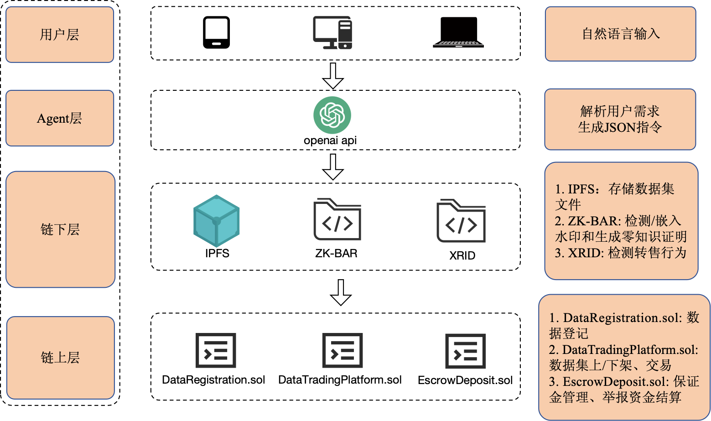

<a href = "./readme.md">English Version</a>

# BDTP：区块链数据交易平台（论文配套开源实现）

**论文题目：**《---------》  
本仓库结合 **Solidity 智能合约、IPFS、ZK-BAR、XRID 与大模型 Agent**，实现一个从数据集登记、交易到举报结算的完整闭环。

---

## 目录

1. [系统架构](#系统架构)
2. [文件结构](#文件结构)
3. [快速启动](#快速启动)
4. [核心功能与脚本](#核心功能与脚本)
5. [环境依赖](#环境依赖)
6. [引用方式](#引用方式)
7. [许可证](#许可证)

---

## 系统架构



系统分为四层：用户 → Agent → 链下脚本 → 链上合约（DataRegistration / DataTradingPlatform / EscrowDeposit）。

---

## 文件结构

```text
.
├── BDTP/                 # 连接 ipfs、生成公私钥对等
├── BDTP_contract/        # Solidity 合约与 Foundry 产物
├── python_call_contract/ # 合约部署 & 调用脚本
├── my_agent_project/     # OpenAI Agent 后端
├── frontend/             # React 前端
├── docs/                 # 演示文档
├── requirements.txt
└── LICENSE
```

---

## 快速启动

共 5  个终端，按顺序执行即可启动系统。

```
# ① 本地区块链
anvil --host 0.0.0.0 --port 8545

# ② IPFS 节点
ipfs daemon

# ③ 部署合约
cd python_call_contract
python deploy.py            # 生成 deploy_address.json

# ④ 启动 Agent / 后端
cd ../my_agent_project
export OPENAI_API_KEY=你的 Key     # Windows: set OPENAI_API_KEY=...
python api_server.py

# ⑤ 启动前端
cd ../frontend
npm install                  # 首次启动需要
npm start
```

浏览器访问 http://localhost:3000。

---

## 核心功能与脚本

| 功能         | 脚本 & 命令示例                                                                                                            | 说明                                        |
| ------------ | -------------------------------------------------------------------------------------------------------------------------- | ------------------------------------------- |
| 数据集登记   | `python function_1_register_dataset.py <owner_addr> <cid>`                                                                 | 上传到 IPFS 并铸造 NFT，收取保证金          |
| 上架 / 下架  | `python function_2_list_nft.py <owner_addr> <tokenId> <price>`<br>`python function_3_unlist_nft.py <owner_addr> <tokenId>` | 调用 `DataTradingPlatform` 合约             |
| 购买数据集   | `python function_4_buy_nft.py check <tokenId>`<br>`python function_4_buy_nft.py purchase <bob_addr> <tokenId> <price>`     | 自动生成水印、零知识证明并转移 NFT          |
| 举报转售     | `python function_7_informer.py report <tokenIdA> <tokenIdB> <jinxAddr>`                                                    | 链下 XRID 检测 + `EscrowDeposit` 保证金结算 |
| Gas 消耗分析 | `python gas_cost_analysis.py`                                                                                              | 批量执行操作并输出 Gas 统计表               |
| 查询工具     | `python get_listed_nfts.py` / `python get_nft_details.py <tokenId>`                                                        | 查看市场与单 NFT 信息                       |

更详细的交互流程、泳道图与实验截图请见 **[docs/demo.md](docs/demo.md)**。

---

## 依赖环境

| 类别            | 版本（论文实验） |
| --------------- | ---------------- |
| 操作系统        | macOS Sequoia    |
| 处理器          | Apple M4 Pro     |
| Solidity        | 0.8.26           |
| Foundry / Anvil | v0.2.0           |
| Node.js         | 22.14.0          |
| Python          | 3.11.5           |
| IPFS            | 0.33.2           |

安装依赖：

```bash
pip install -r requirements.txt   # 安装 Python 包
npm install --prefix frontend      # 安装前端依赖
forge install                      # 安装 Solidity 库（可选）
```

---

## 引用方式

```
@article{---,
  title  = {---},
  author = {---},
  journal= {---},
  year   = {---},
  doi    = {---}
}
```

---

## 许可证

本项目采用 MIT License，详见根目录 LICENSE。
